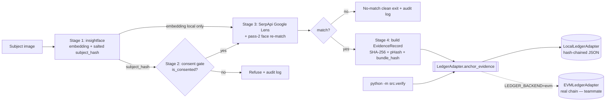

# FaceChain — Consent-Based Face → Web Search → Blockchain Evidence Pipeline

Prove that someone is misusing **your** face online, in a way that stays provable
even after they delete the post.

A person uploads **their own** face. The pipeline searches the web for posts that
reuse their likeness, and when it finds a genuine match it builds a
tamper-evident **evidence bundle** and **anchors its hash on a blockchain**. The
finding is then independently timestamped and verifiable forever — a green
checkmark you can re-check, and that fails loudly the moment anything is altered.

```
  ┌────────────┐   ┌──────────────┐   ┌───────────────────────┐   ┌──────────────────────┐
  │  [1] FACE  │──▶│ [·] CONSENT  │──▶│      [2] SEARCH       │──▶│      [3] CHAIN       │
  │ detect +   │   │ gate: refuse │   │ reverse image search  │   │ hash the evidence &  │
  │ embed +    │   │ if the face  │   │ + re-verify each hit  │   │ anchor it; re-verify │
  │ salt-hash  │   │ isn't opted-in│  │ with face matching    │   │ detects any tamper   │
  └────────────┘   └──────────────┘   └───────────────────────┘   └──────────────────────┘
     Stage 1           Stage 2                 Stage 3                     Stage 4
   insightface      hash-chained          SerpApi Google Lens        LedgerAdapter seam
   (ArcFace)         consent ledger        + pass-2 face re-match     (local today, EVM next)
```

---

## Why consent-based (this is a feature, not a limitation)

Pointing a face search at *strangers* is functionally a stalking tool and is
illegal or restricted in several jurisdictions (Illinois **BIPA**, **GDPR**
Art. 9, Canada's **OPC** ruling against Clearview AI). FaceChain deliberately
inverts it: **you search for misuse of your own likeness.** That framing is
lawful, and it makes the blockchain *necessary* rather than decorative — the
entire value is an independent, tamper-evident, timestamped record that survives
the offending post being taken down.

The consent rule is enforced in code, not just described:

- A subject must be **registered** — `hash(face_embedding + salt) → consent` —
  before any search runs.
- The pipeline **refuses** unregistered / withdrawn subjects with a clear message.
- Every search attempt is **logged** (who, when, which subject, allowed/refused).

---

## Which blockchain, and why the seam matters

Everything in the codebase talks to **one interface**, `LedgerAdapter`
(5 methods). Two implementations sit behind it, chosen by a single env value:

| `LEDGER_BACKEND` | Adapter | Status | What it is |
|---|---|---|---|
| `local` (default) | `LocalLedgerAdapter` | ✅ complete | A real **append-only, hash-chained** JSON ledger on disk. Editing any past entry breaks the chain and is detectable. |
| `evm` | `EVMLedgerAdapter` | 🚧 stub | Same methods/types; a teammate fills in the bodies to anchor on a real EVM chain. |

The brief permits a local/simulated chain, so **`LocalLedgerAdapter` is a valid
submission on its own** — it is our safety net. Flipping to a real chain is a
one-line change (`LEDGER_BACKEND=evm`) with **no other code changes**; the
teammate's success criterion is literally "the shared adapter tests pass against
my adapter." See **[HANDOVER.md](HANDOVER.md)**.

---

## SHA-256 vs perceptual hash (why the bundle stores both)

- **SHA-256** of the matched image → **byte-exact** integrity. One flipped bit
  changes it completely. This is what catches "someone altered the evidence."
- **pHash** (perceptual hash, `imagehash`) → survives crop/recompression, so the
  **same image re-posted elsewhere still matches** (compared by Hamming
  distance, not equality). This is what catches "they re-uploaded it slightly
  changed."

Both go into every evidence bundle. The verifier reports SHA-256 as a hard
pass/fail and pHash distance as "does it still *look* the same."

---

## Biometric handling (non-negotiable)

- **No raw face embedding ever touches the ledger.** The only biometric-derived
  value that leaves this machine is `subject_hash` — a **salted, one-way SHA-256**
  of the embedding. It cannot be inverted back to a face. This constraint is
  baked into the data model and the adapter docs so the on-chain teammate cannot
  violate it by accident.
- Raw images and embeddings stay **local**, under `data/` (gitignored).
- Sample faces are **public-domain** US-government portraits (see
  [samples/SOURCES.md](samples/SOURCES.md)). No scraped photos of private people.

### Immutability vs. right-to-erasure

Chains are append-only, but people have a right to erasure. Answer:
**crypto-shredding.** The sensitive evidence lives **off-chain** (`out/`,
gitignored; encrypt-at-rest in a real deployment); the chain holds only an opaque
**hash pointer** (`bundle_hash`). Destroy the off-chain bundle (or its key) and
the on-chain hash becomes a fingerprint pointing at nothing — erasure achieved
without rewriting history.

---

## Setup from a clean machine (Windows)

Python **3.10** is recommended — the face libraries have the best Windows wheel
coverage there.

```bash
git clone https://github.com/gurkirat309/face-verification.git
cd face-verification
py -3.10 -m venv .venv
.venv\Scripts\activate
pip install -r requirements.txt          # first insightface use downloads a ~280 MB model
copy .env.example .env                    # then edit .env (see below)
```

Edit `.env`:
- `SUBJECT_HASH_SALT` — set a long random string (kept out of git).
- `RIS_PROVIDER=serpapi` and `RIS_API_KEY=<your SerpApi key>` — free tier is fine.
- `LEDGER_BACKEND=local` (default).

Sanity check:
```bash
pytest -q                                 # 41 tests; live search is stubbed/cached, costs 0
```

---

## How to run each piece

```bash
# Face stage only — detect, embed, print the salted subject hash
python -m src.face samples/obama_a.jpg

# Consent — register / status / withdraw (keyed by the face)
python -m src.consent register samples/obama_a.jpg
python -m src.consent status   samples/obama_a.jpg

# Full pipeline: face -> consent gate -> search -> anchor evidence
python -m src.pipeline --image samples/obama_a.jpg            # uses cache (0 searches)
python -m src.pipeline --image samples/obama_a.jpg --refresh  # forces a LIVE search (spends 1)

# Verify an anchored bundle (the tamper test)
python -m src.verify --evidence out/evidence_001.json                  # PASS
python -m src.verify --evidence out/evidence_001.json --tamper-image   # FAIL (image byte flipped)
python tools/tamper_ledger.py && python -m src.verify --evidence out/evidence_001.json  # FAIL (chain break)
```

The search stage caches every SerpApi response, upload, and downloaded image to
`cache/` (gitignored). A cached run costs **zero** searches and is labelled
`CACHED`; a live run is labelled `LIVE (1 search spent)`.

---

## Architecture



Key files: [src/models.py](src/models.py) (shared data models),
[src/ledger/base.py](src/ledger/base.py) (the interface),
[src/ledger/local.py](src/ledger/local.py) (working ledger),
[src/ledger/evm.py](src/ledger/evm.py) (stub),
[src/pipeline.py](src/pipeline.py), [src/verify.py](src/verify.py).

---

## Known limitations (honest)

- **Reverse-image-search coverage gaps.** Google Lens (via SerpApi) is good but
  not exhaustive; some platforms are under-indexed, and very iconic images can
  return an "entity/AI overview" instead of a match list. We upload the image
  bytes (not a URL) to maximise match recall.
- **False positives / negatives.** Face matching has a tunable threshold
  (`FACE_MATCH_THRESHOLD`, default 0.5). Lower = more recall + more false
  positives; higher = the reverse. Measured separation on our samples:
  same-person ≈ 0.73–0.99, different-person ≈ −0.06. Thumbnails lower similarity.
- **Simulated chain ≠ production trust.** `LocalLedgerAdapter` is genuinely
  tamper-evident against edits, but it lives on one disk — it has no distributed
  consensus. That is exactly what `EVMLedgerAdapter` upgrades.
- **Erasure tension** is handled by crypto-shredding (above), which requires the
  off-chain store to be actually destroyed/encrypted; the demo keeps it in
  plaintext under `out/`.
- **Identity vs. image.** A `subject_hash` identifies one *enrolled reference
  embedding*, not a fuzzy identity — two photos of the same person hash
  differently. Fuzzy "same person" comparison is done on raw embeddings locally;
  the hash is only the on-ledger identifier. (A hash cannot do fuzzy matching.)
- **Consent is not authentication.** The audit log records an operator name but
  there is no login system (out of scope by design).

## Repository layout

```
src/
  models.py       shared dataclasses (EvidenceRecord, Receipt, VerificationResult)
  config.py       .env loader + LEDGER_BACKEND factory
  face.py         Stage 1: detect/embed/hash (insightface)
  consent.py      Stage 2: consent gate + CLI
  audit.py        append-only search audit log
  search.py       Stage 3: SerpApi Google Lens + pass-2 face re-match (cached)
  evidence.py     Stage 4: build evidence bundle (SHA-256 + pHash), on-disk layout
  pipeline.py     the end-to-end run
  verify.py       re-verify an anchored bundle (the tamper test)
  ledger/
    base.py       LedgerAdapter interface + required-behaviour contract
    local.py      LocalLedgerAdapter (working, hash-chained)
    evm.py        EVMLedgerAdapter (stub for the teammate)
tests/            41 tests incl. an adapter-agnostic ledger contract suite
tools/            tamper_ledger.py (demo aid)
samples/          public-domain faces + SOURCES.md
data/ out/ cache/ gitignored: images, embeddings, ledger, evidence, RIS cache
```

See **[HANDOVER.md](HANDOVER.md)** (for the on-chain teammate) and
**[REMAINING.md](REMAINING.md)** (the demo/checklist runbook).
